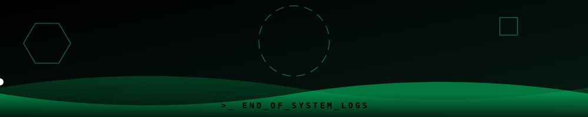

_SYSTEM_BOOT_COMPLETE;>_ACCESS_GRANTED:+adarsh;>_Code+|+Linux+|+AI;>_Building.+Breaking.+Learning." />

---

## Connect

<a href="https://www.linkedin.com/in/YOUR_LINKEDIN_USERNAME">
  
</a>
<a href="mailto:workwithadarsh18@gmail.com">
  
</a>
<a href="https://linktr.ee/adarshmalagond">
  
</a>

---

## About

```bash
adarsh@linux:~$ whoami
Fullstack Developer | Linux-first

adarsh@linux:~$ focus
DevOps • Backend • AI • Systems

adarsh@linux:~$ editor
Neovim (primary) | VSCode (backup)

adarsh@linux:~$ philosophy
Build → Break → Optimize
```
## Languages

## Frameworks & Infrastructure

## Tools & Creative
  
## Quote
<p><b>discipline sharpens the blade
code sharpens the mind<b></p>

_WARNING:+UNAUTHORIZED_ENTITY_DETECTED;>_TARGET_IS_WANDERING_OFF_PATH..." />  
